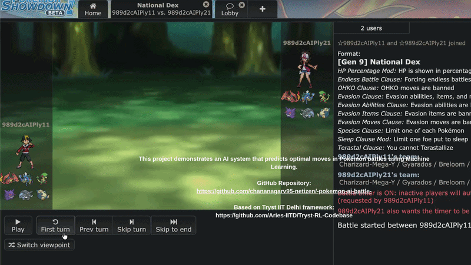

# Pokémon Battle AI (Machine Learning Project)

## 📌 Overview
This project builds an intelligent AI system for Pokémon battles using Machine Learning and rule-based strategies.

The base battle simulation framework was provided during the Tryst IIT Delhi competition. This project extends the framework by implementing custom AI agents, generating battle datasets, and training a machine learning model to predict optimal battle moves.

---

## 🎮 Battle Demo



---

## 🎥 Demo Video
https://youtu.be/af5FeGHQ6FY

---

## 🔗 GitHub Repository
https://github.com/chananagarv95-netizen/-pokemon-ai-battle-

---

## 🧠 Features

- Multiple custom AI battle agents
- Rule-based battle decision system
- Machine Learning move prediction
- Battle dataset generation pipeline
- Random Forest model training
- Pokémon Showdown battle simulation
- Automated AI vs AI battles

---

## ⚙️ My Contributions

### ✅ Rule-Based AI
Implemented AI strategies using:
- Damage calculation
- Speed comparison
- KO prediction
- Best-move selection logic

### ✅ Dataset Generation
- Generated battle data from simulated Pokémon matches
- Extracted battle-state features for ML training

### ✅ Machine Learning Pipeline
- Preprocessed battle datasets
- Trained a Random Forest classifier
- Evaluated model performance using train/test accuracy

### ✅ Battle Automation
- Automated AI vs AI battles
- Integrated ML predictions into battle decisions

---

## 🧠 AI Architecture

### 1️⃣ Rule-Based AI (AI1)
Uses:
- Damage estimation
- Speed checks
- KO prediction
- Strategic move selection

### 2️⃣ Machine Learning AI (AI5)
Uses:
- Random Forest Classifier
- Learned battle patterns from generated datasets
- Predicts the optimal move based on current battle state

---

## 📊 Dataset Features

The ML model was trained using battle-state features such as:

- `my_hp`
- `opp_hp`
- `my_speed`
- `opp_speed`
- `faster`
- `max_my_damage`
- `max_opp_damage`

---

## 🧪 Technologies Used

### Backend / Simulation
- Python
- Pokémon Showdown
- poke-env

### Machine Learning
- scikit-learn
- pandas
- numpy

### Battle Framework
- Node.js

---

## 🚀 Running the Project

## 1️⃣ Clone Repository

```bash
git clone https://github.com/chananagarv95-netizen/-pokemon-ai-battle-
cd -pokemon-ai-battle-
```

---

## 2️⃣ Install Python Requirements

```bash
cd client
pip install -r requirements.txt
```

---

## 3️⃣ Start Pokémon Showdown Server

Open a new terminal:

```bash
cd server
node pokemon-showdown 7850 --no-security
```

---

## 4️⃣ Open Battle UI

Open in browser:

```text
http://localhost:7850
```

---

## 5️⃣ Run AI Battle

Open another terminal:

```bash
cd client
python3 driver.py battle ai1 ai2 --n 10
```

---

## ⚔️ Challenge Competition Bots

```bash
python3 driver.py challenge ai1 5ccf9bAIPly11 --replay
```

### Bot IDs
- `5ccf9bAIPly11`
- `2d8493AIPly11`
- `b815fcAIPly11`
- `e75c45AIPly11`

---

## ⚙️ Configuration

Edit:

```text
client/env.txt
```

Configure:
- Server port
- Connection settings

---

## 🔧 Custom AI Development

Modify:

```text
client/ai.py
```

Add your own AI agents such as:
- ai2
- ai3
- ai4
- ai5

---

## 📁 Full Project Files

A complete project folder (including server dependencies) is available here:

[Google Drive Project Folder](YOUR_GOOGLE_DRIVE_LINK_HERE)

---

## ⚠️ Requirements

- Python 3
- Node.js
- npm

If any dependency issue occurs:

```bash
pip install poke-env
```

---

## 📚 References & Acknowledgment

### Tryst IIT Delhi Base Framework
https://github.com/Aries-IITD/Tryst-RL-Codebase

### poke-env Library
https://github.com/hsahovic/poke-env

### Pokémon Showdown
https://github.com/smogon/pokemon-showdown

---

## 👤 Author

**Garv**